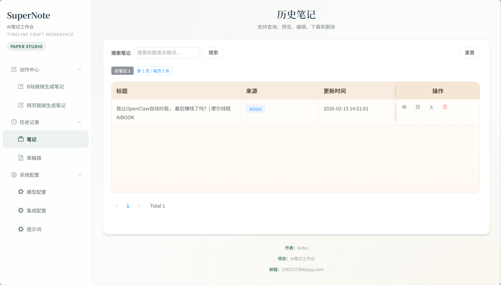
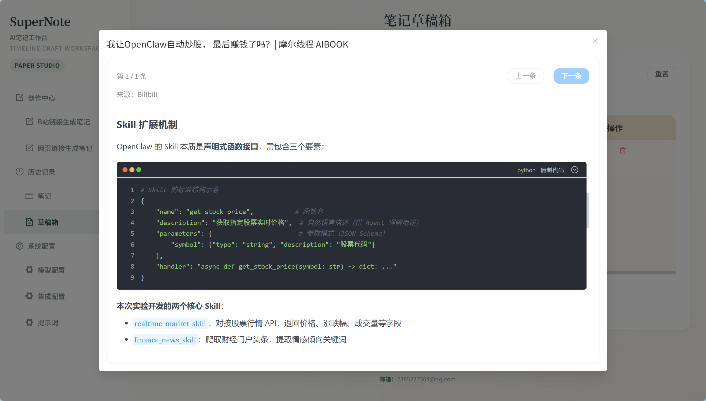
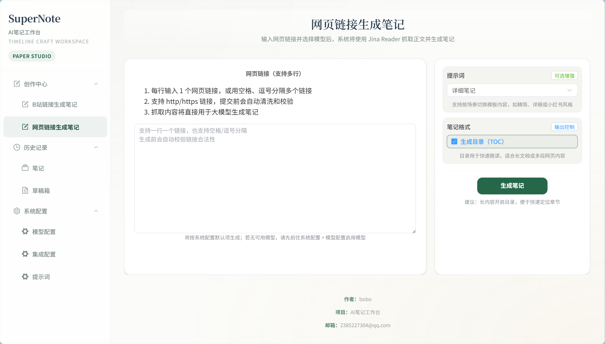
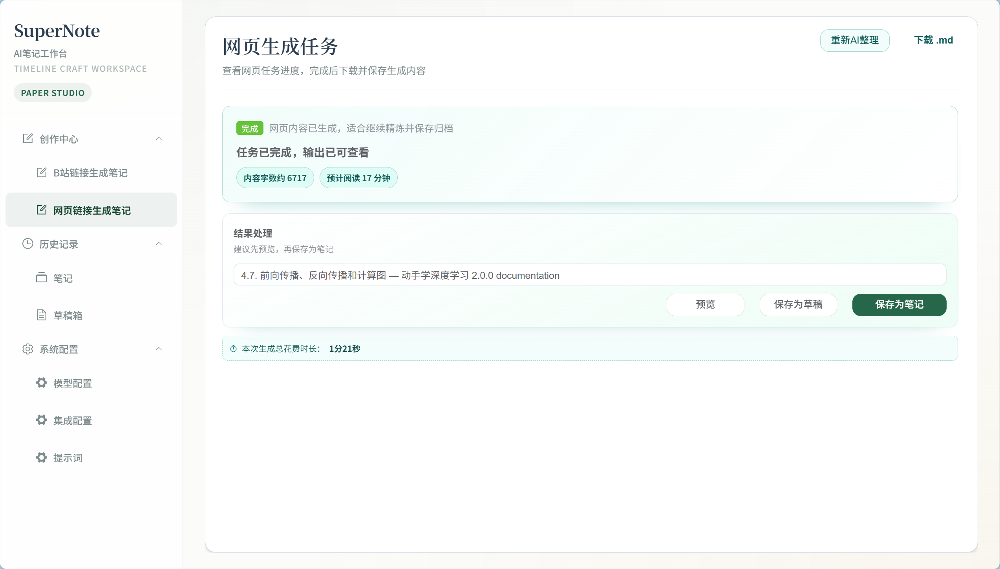
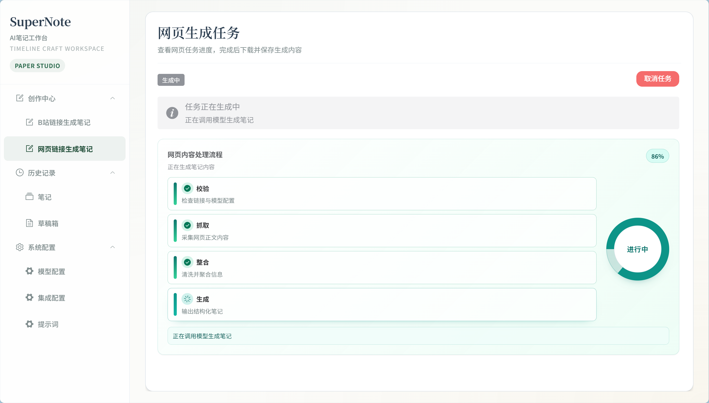
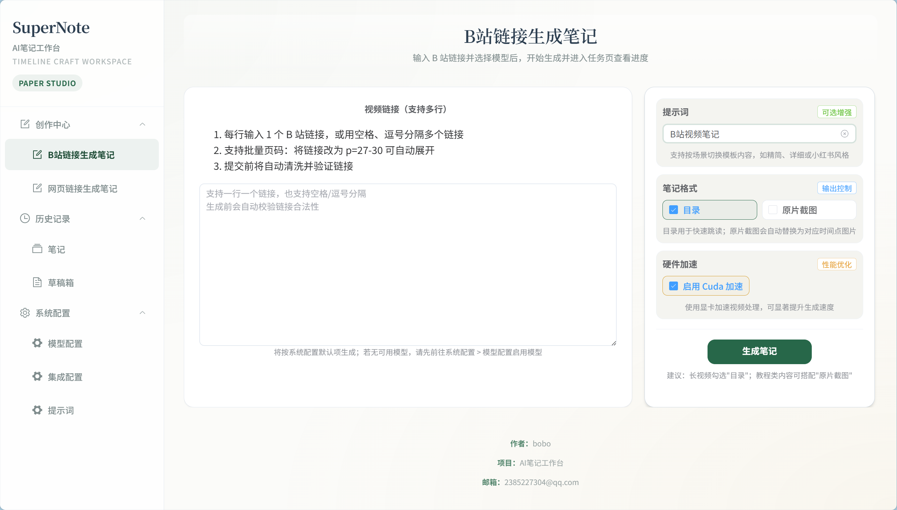
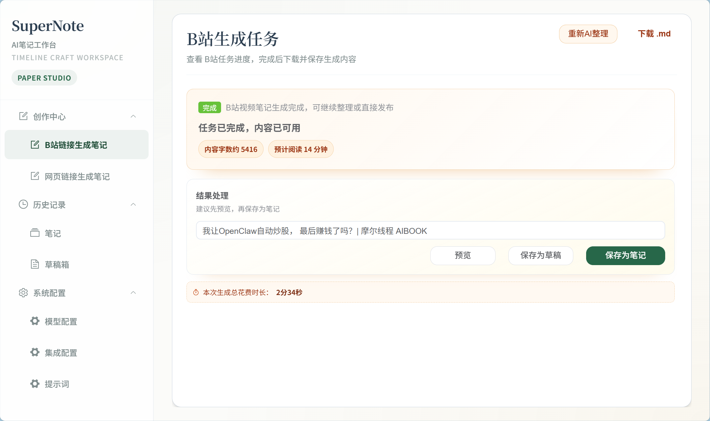
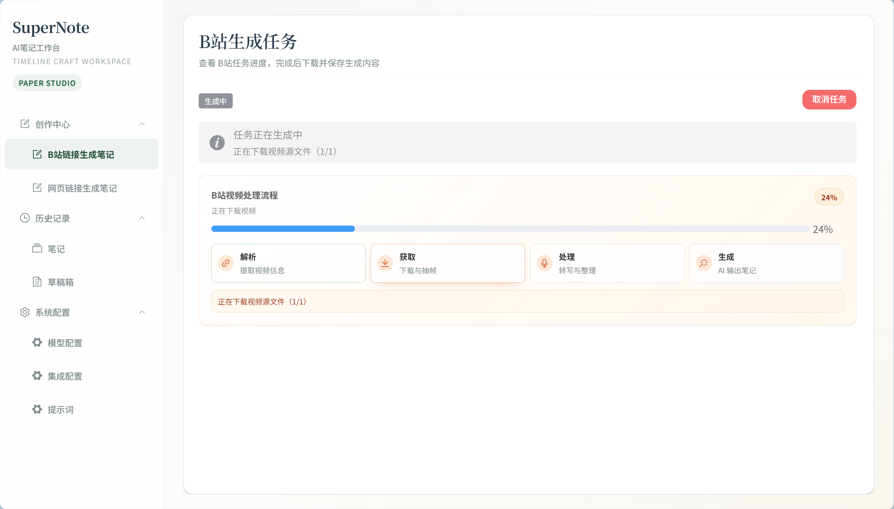

# SuperNote

AI 视频笔记生成工具，让 AI 为 B 站和网页内容自动生成结构化 Markdown 笔记。

## 项目简介

SuperNote 是一个本地优先的笔记生成应用，支持从链接解析、内容提取、转写到总结生成的完整流程，输出可编辑的笔记与草稿。

## 功能特性

- 支持 B 站链接与网页链接两类输入
- 支持任务进度跟踪、历史任务回看
- 支持草稿管理、笔记管理与设置管理
- 支持本地转写（faster-whisper）与多模型配置
- 支持按格式生成结构化 Markdown 笔记

## 截图预览










## 快速开始

### 1. 环境要求

- Node.js `>= 18`
- npm `>= 9`
- Python `>= 3.10`
- FFmpeg（系统 PATH 或 `tools/ffmpeg/bin`）

### 2. 安装依赖

在项目根目录执行：

```bash
npm install
npm --prefix apps/web install
```

### 3. 配置环境变量

```bash
cp .env.example .env
```

Windows PowerShell：

```powershell
Copy-Item .env.example .env
```

### 4. 启动服务

后端：

```bash
npm run dev
```

前端：

```bash
npm run dev:web
```

也可使用一键脚本：

```bat
start.bat
```

```bash
./start.sh
```

## Docker 部署

Docker 入口位于 `infra/docker/`。

```bash
npm run docker:config
npm run docker:up
```

等价命令：

```bash
docker compose -f infra/docker/docker-compose.yml up -d
```

启动后访问：

- 应用地址：`http://localhost:3000`
- 健康检查：`http://localhost:3000/health`

## 常用命令

```bash
npm run build
npm run build:web
npm run typecheck
npm run test:server:all
```

## 常见问题

- `npm install` 网络或 SSL 错误：切换可用 npm 源后重试。
- 找不到 Python/Whisper：确认 Python 已安装并加入 PATH。
- 找不到 FFmpeg：安装后执行 `ffmpeg -version` 验证。
- 端口冲突（`3000`/`3001`）：结束占用进程或修改端口。
- Docker 启动异常：执行 `docker compose -f infra/docker/docker-compose.yml logs -f` 查看日志。

## 运行数据目录

- `storage/data`：持久化数据
- `storage/temp`：临时处理文件
- `storage/public`：生成的静态资源

## License

MIT
